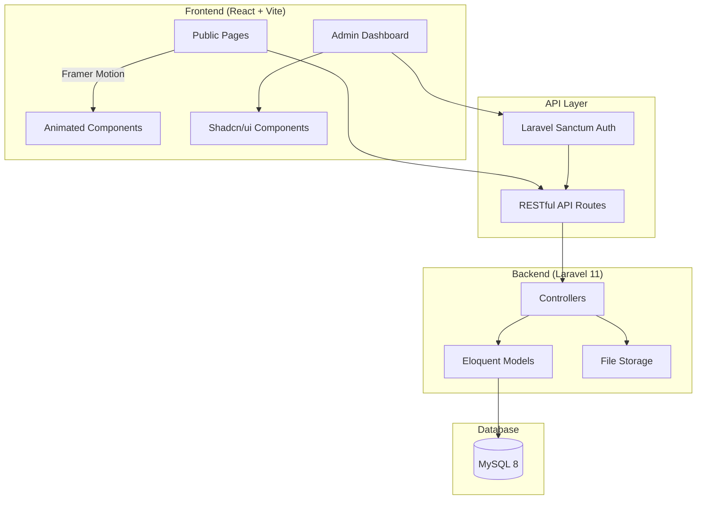

# 🏗️ Savana Taylor Boutique — Website & Admin Dashboard

## 📋 Ringkasan Analisis Brief

Berdasarkan analisis menyeluruh terhadap semua file referensi yang diberikan:

### Brand Identity
| Aspek | Detail |
|-------|--------|
| **Nama** | Savana Taylor Boutique |
| **Tagline** | Custom Made • Exclusive • Elegant • Timeless |
| **Konsep** | Old Money, Premium, Berwibawa |
| **Target Market** | Kejaksaan, Pengacara, Profesional Formal (20–65 tahun) |
| **Pengalaman** | 10+ tahun |

### Color Palette (dari Brief)
| Warna | Hex Code | Penggunaan |
|-------|----------|------------|
| **Maroon** | `#6B0D1A` | Primary / Aksen utama |
| **Gold** | `#D4AF37` | Aksen luxury, ornamen |
| **Black** | `#111111` | Background utama, teks |
| **Cream** | `#F7F4EF` | Background sections, kontras |
| **White** | `#FFFFFF` | Text light, clean areas |

### Typography (dari Brief)
- **Header**: Playfair Display (serif, elegant, old-money feel)
- **Body**: Montserrat (modern, readable, professional)

---

## 📑 Struktur Halaman Website

Berdasarkan analisis mockup dan brief, website membutuhkan halaman-halaman berikut:

### Frontend Pages (Public)

| # | Halaman | Deskripsi |
|---|---------|-----------|
| 1 | **Homepage** | Hero section, USP badges, collection grid, best sellers, appointment CTA, footer |
| 2 | **Baju Dinas** | Kategori PDL/PDH/PDU/PIDSUS/PIDUM/Pembinaan/Adhyaksa/Adhyaksa Intel, sistem warna, jenis bahan |
| 3 | **Men Collection** | Baju Dinas Lapangan, PDH, PDU, PIDSUS, PIDUM, Pembinaan, Adhyaksa, Formal Wear, One Set Formal |
| 4 | **Women Collection** | Kebaya, Baju IAD, Dress, Batik, Kemeja Wanita, Jas Wanita, One Set Wanita |
| 5 | **Custom Tailor** | Proses Custom (Konsultasi → Pilih Bahan → Pengukuran → Produksi), pilihan bahan premium |
| 6 | **Rental** | Layanan rental pria & wanita, full set / opsional |
| 7 | **Membership** | Program Regular & Priority membership |
| 8 | **About Us** | Sejarah brand, visi misi, tim |
| 9 | **Contact** | Alamat, WhatsApp, Instagram, TikTok, jam operasional, form appointment |
| 10 | **Product Detail** | Detail produk individual dengan gambar, harga, dan CTA WhatsApp |

### Admin Dashboard Pages

| # | Halaman | Deskripsi |
|---|---------|-----------|
| 1 | **Dashboard Overview** | Statistik pengunjung, jumlah produk, pesanan masuk, appointment |
| 2 | **Product Management** | CRUD produk (nama, kategori, harga, gambar, stok, status custom/ready) |
| 3 | **Category Management** | Kelola kategori & sub-kategori (Baju Dinas, Men, Women, dll) |
| 4 | **Order Management** | Daftar order dari WhatsApp, status tracking |
| 5 | **Appointment Management** | Jadwal appointment, konfirmasi, reschedule |
| 6 | **Membership Management** | Kelola data member, tier, history |
| 7 | **Gallery/Media** | Upload & kelola foto produk |
| 8 | **Content Management** | Edit konten halaman (hero text, about us, dll) |
| 9 | **Settings** | Jam operasional, kontak info, social media links |
| 10 | **User Management** | Admin users, role & permission |

---

## 🛠️ Rekomendasi Tech Stack

### Backend: Laravel 11

| Komponen | Library/Package | Alasan |
|----------|----------------|--------|
| **Framework** | Laravel 11 | PHP framework terbaik, MVC, Eloquent ORM, built-in auth |
| **API** | Laravel API Resources | RESTful API untuk React frontend |
| **Auth** | Laravel Sanctum | SPA-friendly token authentication |
| **File Storage** | Laravel Storage (Local/S3) | Upload & manage gambar produk |
| **Admin Auth** | Spatie Permission | Role-based access control |
| **Image Processing** | Intervention Image v3 | Resize, crop, watermark foto produk |
| **Slugs** | Spatie Sluggable | URL-friendly product names |
| **SEO** | artesaos/seotools | Meta tags management |
| **Sitemap** | spatie/laravel-sitemap | Auto-generate sitemap |
| **Database** | MySQL 8 | Relational DB via Laragon |

### Frontend: React 18 + Vite

| Komponen | Library | Alasan |
|----------|---------|--------|
| **Build Tool** | Vite 5 | Fast HMR, optimal bundling |
| **UI Framework** | React 18 | Component-based, ecosystem terbesar |
| **Routing** | React Router v6 | Client-side routing, nested routes |
| **Animation** | Framer Motion | Animasi smooth, gesture support, scroll animations |
| **State Mgmt** | Zustand / React Query | Lightweight state + server state caching |
| **HTTP Client** | Axios | API calls ke Laravel backend |
| **Styling** | CSS Modules + Vanilla CSS | Custom styling sesuai brand, tanpa framework bloat |
| **Icons** | Lucide React | Clean, minimal icon set |
| **Image Gallery** | React Photo Album + Lightbox | Galeri produk interaktif |
| **Scroll Animations** | Framer Motion + Intersection Observer | Scroll-triggered animations seperti Wong Hang |
| **Forms** | React Hook Form + Zod | Form validation untuk appointment & contact |
| **Toast/Notification** | Sonner | Notifikasi elegant |
| **Carousel/Slider** | Swiper | Product slider, hero carousel |
| **SEO** | React Helmet Async | Dynamic meta tags per halaman |

### Admin Dashboard: React (Integrated)

| Komponen | Library | Alasan |
|----------|---------|--------|
| **UI Components** | Shadcn/ui | Premium-looking components, customizable |
| **Charts** | Recharts | Dashboard analytics charts |
| **Tables** | TanStack Table v8 | Sortable, filterable data tables |
| **File Upload** | React Dropzone | Drag & drop image upload |
| **Rich Text Editor** | TipTap | Content management editing |
| **Date Picker** | React Day Picker | Appointment scheduling |

---

## 🎨 Konsep Desain & UX

### Perbandingan dengan Wong Hang Tailor

| Aspek | Wong Hang | Savana Taylor (Rencana) |
|-------|-----------|------------------------|
| **Tone** | Modern minimalist, dark luxury | Old-money elegant, maroon-gold luxury |
| **Hero** | Full-screen video/slider, horizontal scroll process | Cinematic hero dengan parallax, subtle gold particles |
| **Navigation** | Horizontal centered nav | Sticky navbar, maroon accent, gold logo |
| **Animations** | Scroll-triggered reveals, parallax | Framer Motion scroll reveals, stagger animations, smooth page transitions |
| **Process Display** | Horizontal timeline steps | Vertical/horizontal numbered steps dengan gold connectors |
| **Product Grid** | Minimal cards | Hover-reveal cards dengan gold border accent |
| **Feel** | International luxury menswear | Indonesian premium formal/official tailor |

### Fitur Animasi & Interaksi (Framer Motion)

1. **Page Transitions** — Smooth fade/slide antar halaman
2. **Scroll Reveal** — Elemen muncul saat di-scroll (stagger effect)
3. **Hero Parallax** — Background image parallax movement
4. **Product Cards** — Hover scale + overlay reveal
5. **Gold Line Animations** — Decorative lines yang animate saat visible
6. **Counter Animation** — Angka (10+ tahun, dll) counting up saat visible
7. **Navigation** — Smooth underline animation pada menu hover
8. **Loading Screen** — Logo reveal animation saat pertama load
9. **Cursor Effects** — Custom cursor pada hero section (optional)
10. **Gallery Lightbox** — Smooth image open/close dengan backdrop blur

---

## 🗄️ Database Schema (High-Level)

```
┌─────────────┐     ┌──────────────┐     ┌─────────────────┐
│   users      │     │  categories  │     │    products      │
├─────────────┤     ├──────────────┤     ├─────────────────┤
│ id           │     │ id           │     │ id               │
│ name         │     │ name         │     │ category_id (FK) │
│ email        │     │ slug         │     │ name             │
│ password     │     │ parent_id    │     │ slug             │
│ role         │     │ description  │     │ description      │
│ ...          │     │ image        │     │ price_from       │
└─────────────┘     │ order        │     │ type (custom/ready)│
                     └──────────────┘     │ is_set           │
                                          │ status           │
┌─────────────────┐                       │ featured         │
│ product_images   │                       │ ...              │
├─────────────────┤                       └─────────────────┘
│ id               │
│ product_id (FK)  │  ┌──────────────────┐  ┌────────────────┐
│ image_path       │  │  appointments     │  │  members        │
│ is_primary       │  ├──────────────────┤  ├────────────────┤
│ order            │  │ id               │  │ id              │
└─────────────────┘  │ name             │  │ name            │
                      │ phone            │  │ phone           │
┌─────────────────┐  │ email            │  │ email           │
│  site_settings   │  │ date             │  │ tier            │
├─────────────────┤  │ time             │  │ points          │
│ id               │  │ service_type     │  │ join_date       │
│ key              │  │ notes            │  │ ...             │
│ value            │  │ status           │  └────────────────┘
│ group            │  │ ...              │
└─────────────────┘  └──────────────────┘

┌─────────────────┐  ┌──────────────────┐
│  orders          │  │  page_contents   │
├─────────────────┤  ├──────────────────┤
│ id               │  │ id               │
│ customer_name    │  │ page             │
│ customer_phone   │  │ section          │
│ product_id       │  │ title            │
│ type             │  │ content          │
│ status           │  │ image            │
│ notes            │  │ ...              │
│ total            │  └──────────────────┘
│ ...              │
└─────────────────┘
```

---

## 📁 Struktur Project

```
savana-tailor/
├── app/                          # Laravel Backend
│   ├── Http/
│   │   ├── Controllers/
│   │   │   ├── Api/              # API Controllers (public)
│   │   │   │   ├── ProductController.php
│   │   │   │   ├── CategoryController.php
│   │   │   │   ├── AppointmentController.php
│   │   │   │   ├── PageContentController.php
│   │   │   │   └── SettingController.php
│   │   │   └── Admin/            # Admin Controllers
│   │   │       ├── DashboardController.php
│   │   │       ├── ProductController.php
│   │   │       ├── OrderController.php
│   │   │       ├── AppointmentController.php
│   │   │       ├── MemberController.php
│   │   │       └── SettingController.php
│   │   ├── Middleware/
│   │   └── Resources/            # API Resources (JSON transformers)
│   ├── Models/
│   │   ├── Product.php
│   │   ├── Category.php
│   │   ├── Appointment.php
│   │   ├── Order.php
│   │   ├── Member.php
│   │   ├── PageContent.php
│   │   └── SiteSetting.php
│   └── Services/
├── database/
│   ├── migrations/
│   └── seeders/
├── routes/
│   ├── api.php                   # Public API routes
│   └── web.php                   # SPA catch-all route
├── resources/
│   └── views/
│       └── app.blade.php         # Single entry point for React SPA
├── frontend/                     # React Frontend (Vite)
│   ├── src/
│   │   ├── assets/
│   │   │   ├── fonts/
│   │   │   ├── images/
│   │   │   └── icons/
│   │   ├── components/
│   │   │   ├── layout/
│   │   │   │   ├── Navbar.jsx
│   │   │   │   ├── Footer.jsx
│   │   │   │   ├── PageTransition.jsx
│   │   │   │   └── LoadingScreen.jsx
│   │   │   ├── ui/
│   │   │   │   ├── Button.jsx
│   │   │   │   ├── Card.jsx
│   │   │   │   ├── GoldDivider.jsx
│   │   │   │   └── SectionTitle.jsx
│   │   │   ├── home/
│   │   │   │   ├── HeroSection.jsx
│   │   │   │   ├── USPBadges.jsx
│   │   │   │   ├── CollectionGrid.jsx
│   │   │   │   ├── BestSeller.jsx
│   │   │   │   └── AppointmentCTA.jsx
│   │   │   └── shared/
│   │   │       ├── ProductCard.jsx
│   │   │       ├── WhatsAppButton.jsx
│   │   │       └── ScrollReveal.jsx
│   │   ├── pages/
│   │   │   ├── public/
│   │   │   │   ├── HomePage.jsx
│   │   │   │   ├── BajuDinasPage.jsx
│   │   │   │   ├── MenCollectionPage.jsx
│   │   │   │   ├── WomenCollectionPage.jsx
│   │   │   │   ├── CustomTailorPage.jsx
│   │   │   │   ├── RentalPage.jsx
│   │   │   │   ├── MembershipPage.jsx
│   │   │   │   ├── AboutPage.jsx
│   │   │   │   ├── ContactPage.jsx
│   │   │   │   └── ProductDetailPage.jsx
│   │   │   └── admin/
│   │   │       ├── DashboardPage.jsx
│   │   │       ├── ProductsPage.jsx
│   │   │       ├── CategoriesPage.jsx
│   │   │       ├── OrdersPage.jsx
│   │   │       ├── AppointmentsPage.jsx
│   │   │       ├── MembersPage.jsx
│   │   │       ├── GalleryPage.jsx
│   │   │       ├── ContentPage.jsx
│   │   │       ├── SettingsPage.jsx
│   │   │       └── UsersPage.jsx
│   │   ├── hooks/
│   │   │   ├── useScrollReveal.js
│   │   │   ├── useApi.js
│   │   │   └── useAuth.js
│   │   ├── services/
│   │   │   └── api.js
│   │   ├── stores/
│   │   │   └── authStore.js
│   │   ├── styles/
│   │   │   ├── globals.css
│   │   │   ├── variables.css
│   │   │   └── animations.css
│   │   ├── App.jsx
│   │   └── main.jsx
│   ├── index.html
│   ├── vite.config.js
│   └── package.json
├── public/
│   ├── storage/ -> ../storage/app/public
│   └── build/                    # Vite build output
├── Foto Produk/                  # Asset produk (akan dipindah ke storage)
├── Logo/                         # Logo brand
├── Referensi Utama/              # Brief files (tidak di-deploy)
├── composer.json
└── .env
```

---

## 🔗 Arsitektur Integrasi



### Flow Arsitektur:
1. **React SPA** di-serve melalui single Blade view (`app.blade.php`)
2. **Vite** di-integrate dengan Laravel via `laravel-vite-plugin`
3. **API** dilayani melalui `/api/*` routes (Laravel)
4. **Auth Admin** menggunakan Sanctum (cookie-based SPA auth)
5. **Public pages** fetch data via public API endpoints (no auth required)
6. **Admin pages** require auth + role check via middleware

---

## User Review Required

> [!IMPORTANT]
> ### Keputusan Arsitektur yang Perlu Disetujui:
> 1. **Monorepo vs Separate Repos** — Rencana saat ini: monorepo (Laravel + React dalam satu project). Apakah setuju?
> 2. **React Router vs Inertia.js** — React Router memberikan full SPA control + Framer Motion page transitions. Inertia.js lebih tightly coupled dengan Laravel. Rekomendasi: **React Router** untuk fleksibilitas animasi.
> 3. **Shadcn/ui untuk Admin** — Menggunakan component library Shadcn/ui untuk admin dashboard agar cepat dan professional. Setuju?

## Open Questions

> [!IMPORTANT]
> ### Pertanyaan untuk Klien/User:
> 1. **Domain & Hosting** — Apakah sudah ada domain (savanatailorboutique.com) dan rencana hosting (VPS/shared)?
> 2. **Marketplace** — Di brief awal klien menyebut "marketplace". Apakah ini berarti integrasi Shopee/Tokopedia, atau fitur e-commerce di website sendiri (keranjang belanja, checkout)?
> 3. **Payment Gateway** — Brief menyebutkan hanya transfer bank & cash. Apakah perlu integrasi payment gateway (Midtrans/Xendit) di website, atau cukup redirect ke WhatsApp?
> 4. **Multi-language** — Apakah website perlu bilingual (Indonesia + English)?
> 5. **Membership System** — Seberapa kompleks? Cukup form registrasi + database, atau butuh point system, tier, dll?
> 6. **Rental System** — Apakah perlu availability calendar, atau cukup listing + CTA WhatsApp?
> 7. **Konten Awal** — Apakah klien sudah menyiapkan copywriting untuk setiap halaman, atau kita perlu buatkan?
> 8. **Logo Format** — Logo PNG yang ada sudah bagus. Apakah ada versi SVG/vector untuk web?
> 9. **Timeline** — Berapa target waktu penyelesaian project ini?
> 10. **Mobile App** — Apakah ke depan ada rencana mobile app? Jika ya, arsitektur API-first ini sudah siap.

---

## Verification Plan

### Automated Tests
- Unit tests untuk API endpoints (PHPUnit)
- Feature tests untuk auth flow
- React component tests (Vitest + React Testing Library)

### Manual Verification
- Cross-browser testing (Chrome, Safari, Firefox, Edge)
- Mobile responsive testing (iPhone, Android)
- Lighthouse audit (Performance, SEO, Accessibility)
- WhatsApp deep-link testing di mobile
- Admin CRUD operations end-to-end
